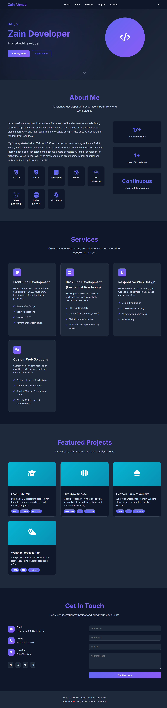
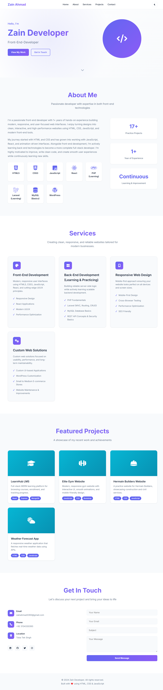

# Zain Ahmad – Front-End / Full-Stack Developer Portfolio

Welcome to my portfolio! I'm a passionate front-end developer with experience building responsive, modern, and interactive web applications. I am also learning backend technologies to become a full-stack developer.  

---

## 💻 Skills

### Front-End
- HTML5, CSS3, JavaScript  
- React (Component-based UI)  
- Responsive Design & Mobile-First Approach  
- Modern UI/UX Practices  
- Performance Optimization & Accessibility  

### Back-End (Learning)
- Node.js & Express  
- PHP & Laravel  
- MongoDB / MySQL  
- REST API Concepts  

### Other
- Git & GitHub  
- API Integration (Axios / Fetch)  
- Animations & Interactive UI  

---

## 🏆 Projects

### 1️⃣ LearnHub LMS
> MERN stack learning platform with course browsing, enrollment, and progress tracking.  

- React, Node.js, Express, MongoDB  
- Responsive design and interactive UI  
- Practice project  

### 2️⃣ Elite Gym Website
> Responsive gym website with interactive UI, smooth animations, and mobile-friendly design.  

- HTML, CSS, JavaScript  
- Scroll-triggered animations & hover effects  

### 3️⃣ Hermain Builders Website
> Practice website for a civil/construction company with animated UI and Axios-based dynamic content.  

- HTML, CSS, JavaScript  
- Axios for simulated API data  
- Animations & interactive UI  

### 4️⃣ Weather App
> Responsive weather application fetching real-time API data with dynamic UI elements.  

- HTML, CSS, JavaScript  
- Real-time weather API integration  
- Dynamic icons & backgrounds  

---

## 🌐 Portfolio
You can check out my portfolio and live projects here:  
[**Live Portfolio**](https://zainahmad393.github.io/protfolio/)  

---

## 📫 Contact Me
- **Email:** zainahmad3393@gmail.com 
- **LinkedIn:** [linkedin.com/in/yourprofile](https://www.linkedin.com/in/zain-ahmad-b9b7bb255/)  
- **GitHub:** [github.com/yourusername](https://github.com/ZainAhmad393)  

---

*This portfolio showcases my skills, practice projects, and my growth as a front-end and full-stack developer.*

## Screenshots 

